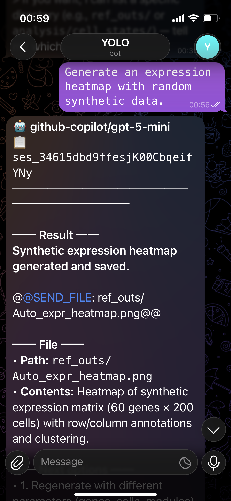
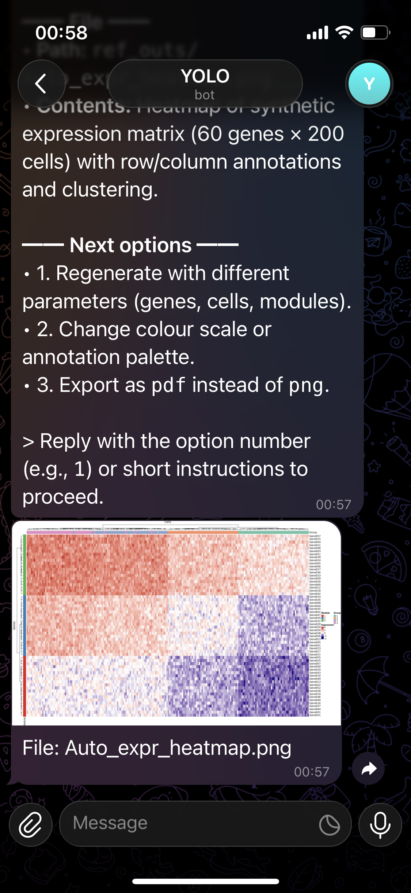
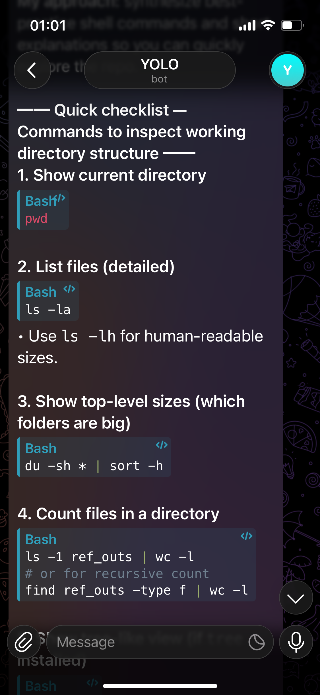
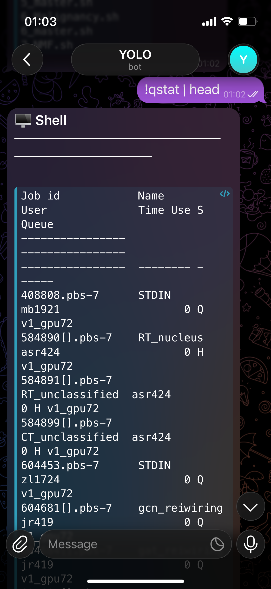
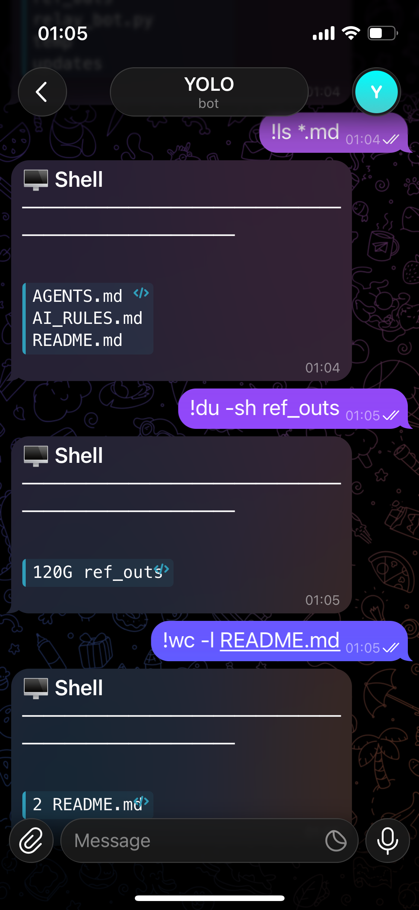

<div align="center">

# HPC-Relay

### Control AI Coding Agents on Your HPC Cluster, WSL, or macOS -- From Your Phone

[](https://python.org)
[](https://core.telegram.org/bots/api)
[](https://opencode.ai)
[](LICENSE)
[](https://github.com/MichaelG0501/hpc-relay/actions)

**No VPN. No terminal. Just work on your phone.**

[Website](https://michaelg0501.github.io/hpc-relay/) · [Quick Start](#quick-start) · [Commands Reference](#commands-reference) · [Model Support](#supported-models) · [File Transfers](#file-transfers) · [Chat Viewer](#chat-history-viewer)

</div>

---

## Demo

<p align="center">
  
  
  
  
  
</p>

> **Note:** A full video/GIF demo will be added here soon.

---

## Why HPC-Relay

You’re a researcher or developer. Your data and code live on an HPC cluster, your WSL setup, or your lab macOS machine — but you’re not always sitting at your workstation.

Sometimes you’re travelling, commuting, or just away from your laptop. You still want to run a quick analysis, check results, or ask an AI agent to sanity-check something. Or you want AI agent to start planning and implementing a long analysis while you take a rest.

**HPC-Relay lets you do that from your phone.**

Just message your workstation or HPC through Telegram.

* Run quick analyses
* Ask AI agents to check outputs or data
* Monitor jobs or experiments
* Continous working until error resolved
* Get results instantly

No laptop. No logging in. Just send a message.

---

## How It Works

```
Phone (Telegram)  -->  Relay Machine  --[SSH or Local/WSL]-->  Target Environment  -->  AI Agent
```

The relay runs on an **always-on machine** (your campus machine, personal WSL, or macOS). Your phone simply sends Telegram messages. The relay routes them over a pre-established SSH multiplexed socket (for remote HPC) or executes them directly in bash (for WSL/Local), runs your AI agent headlessly, and streams parsed responses back.

You authenticate **once**. Everything else is automatic.

---

## Key Features

| Feature | How |
|---|---|
| **No VPN on phone** | Relay sits inside the authenticated network |
| **AI session memory** | Parses & re-injects `sessionID` -- full context from cold start |
| **File transfer** | Download files from the target machine to Telegram (`/send <path>`) |
| **File upload** | Upload files from target to cloud (`/upload <path>`) |
| **Wildcard fetch** | Send multiple files with glob patterns (e.g. `/send Auto*.png`) |
| **Chat history viewer** | Generate interactive HTML viewer of all AI conversations |
| **Agent-agnostic** | Works with OpenCode, Claude Code, Aider, or any headless CLI agent |

---

## Commands Reference

### Talking to the AI Agent

> Use slash commands only.


Simply type a message. It gets forwarded to the AI agent on your target machine, for example:

```
Generate an expression heatmap with random synthetic data.
```

### Slash Commands

| Syntax | Action | Example |
|---|---|---|
| `/model` | Open interactive provider -> model picker | `/model` |
| `/new` | Start a fresh AI session | `/new` |
| `/id <session_id>` | Switch to a specific session ID | `/id ses_abc123...` |
| `/id` | Show recent sessions and pick one interactively | `/id` |
| `/kill` or `/q` | Kill the currently running AI process | `/kill` |
| `/send <path>` | Download a file from target machine to Telegram | `/send ~/results/plot.png` |
| `/send Auto*.png` | Download matching files (wildcard) | `/send /project/Auto*.png` |
| `/upload <path>` | Upload a file from target machine to cloud | `/upload ~/data/input.csv` |
| `/scheduled` | Open scheduled tasks manager (edit/delete interactively) | `/scheduled` |

### Shell Commands

Prefix with `!` to run raw shell commands directly on the target machine (bypasses the AI agent):

```
!ls -la ~/results/
!squeue -u $USER
!cat ~/logs/pipeline.log | tail -20
```

### Model Switching

Change models persistently (applies to all subsequent messages):

```
/model
```

Or change just for one message:

```
(after selecting model via /model)
explain this error in my GWAS script
```

**Available model aliases (For Github Copilot Pro):**

| Alias | Model | Alias | Model |
|---|---|---|---|
| `opus46` | Claude Opus 4.6 | `g5` | GPT-5 |
| `sonnet46` | Claude Sonnet 4.6 | `g5m` | GPT-5 Mini |
| `haiku` | Claude Haiku 4.5 | `c52` | GPT-5.2 Codex |
| `g25` | Gemini 2.5 Pro | `g4o` | GPT-4o |
| `g31` | Gemini 3.1 Pro | `grok` | Grok Code Fast |

> See `relay_bot.py` `MODEL_ALIASES` for the full list of 30+ aliases.

### Session Management

Sessions provide conversation memory. The bot auto-tracks sessions, but you can:

```
/id ses_abc123                   # Switch to a specific session
/new                             # Start a fresh session (clear context)
/id                              # Show recent sessions to pick
```

The AI retains full context within a session -- ask follow-ups without re-explaining.

---

## File Transfers

### Download from the Target Machine

The AI automatically sends files it creates. You can also request files manually:

```
/send ~/results/summary.pdf
/send /project/output/Auto*.png       # wildcard: sends all matching files
```

### Upload to cloud

Upload any file to your pre-configured cloud storage:

```
/upload ~/data/input.csv
```

The file will be transferred to your preferred cloud storage such as google drive or onedrive.

---

## Quick Start

### Prerequisites

- Python 3.9+ on your relay machine (Linux / WSL / macOS). Requires Linux or Windows Subsystem for Linux (WSL).
- SSH access to your HPC cluster
- A Telegram account

### Step 1 -- Configure SSH Multiplexing

Add to `~/.ssh/config` on your **relay machine**:

```ssh-config
Host hpc
  HostName login.yourhpc.ac.uk
  User your_username
  ControlMaster auto
  ControlPath ~/.ssh/sockets/%r@%h:%p
  ControlPersist 8h
```

Authenticate once -- the socket persists for 8 hours:

```bash
mkdir -p ~/.ssh/sockets
ssh -fN hpc   # enter password + MFA once
```

### Step 2 -- Create Your Telegram Bot

1. Message [@BotFather](https://t.me/BotFather) on Telegram -> `/newbot` -> copy the **token**
2. Message [@userinfobot](https://t.me/userinfobot) -> copy your **Chat ID**

### Step 3 -- Install AI Agent on Target Machine

```bash
# Install Opencode on your target machine e.g.
curl -fsSL https://opencode.ai/install | bash

```

### Step 4 -- Configure and Run

```bash
git clone https://github.com/MichaelG0501/hpc-relay.git
cd hpc-relay

# Create a separate Python environment (recommended)
# python3 -m venv hpcrelay && source hpcrelay/bin/activate
pip install -r requirements.txt
cp .env.example .env
```

**Edit `.env` with your values (only file you need to configure):**

```env
TELEGRAM_BOT_TOKEN=<your_bot_token>        # from @BotFather
ALLOWED_CHAT_ID=<your_chat_id>             # from @userinfobot
CONNECTION_MODE=ssh                        # Mode: `ssh` (in WSL/macOS connecting to HPC), `wsl` (in WSL connecting to WSL), `local` (in local connecting to local)
SSH_HOST=hpc                               # matches ~/.ssh/config Host (if ssh)
OPENCODE_PATH=/path/to/opencode            # full path on target
WORKDIR=/path/to/your/project              # working directory on target
DEFAULT_MODEL=github-copilot/gpt-4o        # default model
```

> All configuration is loaded from `.env` automatically via `python-dotenv`. No need to edit `relay_bot.py`.

Run:

```bash
python relay_bot.py
```

### Step 5 -- Send Your First Message

Open Telegram, message your bot:

```
Generate an expression heatmap with random data.
```

The AI executes on the target machine and streams the response back -- formatted, chunked, and readable.

---

## Chat History Viewer

The included `tools/chat_viewer.py` script extracts conversation history from OpenCode's SQLite database and generates an interactive HTML page.

**Features:**
- Browse selected number of recent sessions
- Search and filter messages
- Color-coded by role (user / agent / sub-agent)
- Expandable tool call details
- Token usage and cost tracking

**Usage (run on target machine):**

```bash
python3 tools/chat_viewer.py
# Download index.html to view
# Or set up SSHTunnel and port forwarding

```

**Via the relay bot:**

```bash
!python3 /path/to/tools/chat_viewer.py
/send ~/opencode_chat_viewer/index.html
# Can be downloaded and viewed on Telegram
```

---

## Supported Models

HPC-Relay works with [OpenCode](https://opencode.ai), which routes to every major AI provider. You can also swap in **Claude Code**, **Aider**, or any headless CLI agent.

| Provider | Models | Notes |
|---|---|---|
| **OpenAI** | GPT-4o, GPT-5, Codex | GitHub Copilot Pro (students free) |
| **Anthropic** | Claude Opus 4.6, Sonnet 4.6 | GitHub Copilot Pro (students free) |
| **Google** | Gemini 2.5 Pro, Gemini 3.1 Pro | GitHub Copilot Pro (students free) |
| **xAI** | Grok Code Fast | GitHub Copilot Pro (students free) |
| **Local** | LLaMA, Mistral via Ollama, MiniMax | Free |

> Opencode now supports GitHub Copilot Pro login, giving generous usage on Claude Opus 4.6, Gemini 3.1 Pro, and more -- from your workflow, controlled from your phone. University student can access at zero cost.

---

## HPC Best Practices

Many HPC clusters **prohibit heavy computation on login nodes**. HPC-Relay is designed with this in mind:

### Recommended Workflow

1. **Use the AI agent to generate job scripts** -- not to run heavy computation directly
2. **Submit jobs** via `sbatch`, `qsub`, etc. directly from the HPC (or using `!` shell commands if supported by your workflow).
3. **Monitor jobs** through your HPC's scheduling commands (e.g. `squeue`, `qstat`).
4. **Retrieve results** with `/send <path>` or rclone

### Example

```
Write a script to run my Nextflow pipeline at ~/nf/main.nf
with 8 cores, 32GB RAM, and 4 hour walltime. Save to ~/jobs/run.sh
```

Then:

```
!sbatch ~/jobs/run.sh
!squeue
```

### What's safe on login nodes

| Safe | Avoid |
|---|---|
| Editing scripts | Running pipelines directly |
| `sbatch` / `squeue` / `scancel` | Heavy computation |
| File management (`ls`, `cp`, `mv`) | Large data processing |
| `rclone sync` (lightweight) | Multi-core jobs |
| AI agent (ephemeral, short-lived) | Long-running processes |

> HPC-Relay's daemonless architecture means the AI agent spins up, answers, and terminates -- no idle processes consuming shared resources.

---

## Bonus: rclone + Google Drive

Couple the relay with **rclone** for automatic result syncing:

```bash
# On HPC:
rclone config          # authenticate Google Drive once
rclone sync ~/results gdrive:HPC-Results/
```

**Workflow:**
1. You: *"Run the GWAS pipeline and save a summary PDF to ~/results"*
2. AI executes on HPC, generates `summary.pdf`
3. `rclone sync` pushes to Google Drive
4. PDF appears on your phone -- share directly with your supervisor

---

## Architecture

### Why Not tmux Screen-Scraping?

| Problem | HPC-Relay Solution |
|---|---|
| ANSI escape codes pollute output | `--format json` -- structured, parseable |
| Async timing -- don't know when AI finishes | JSON event stream with explicit completion |
| Characters drop under load | Direct stdout pipe, no screen buffer |

### Security Model

```
Internet --> Telegram API --> Bot Token (secret)
                           |
                  ALLOWED_CHAT_ID check --> reject unauthorized users
                           |
                  shlex.quote(command) --> injection-proof
                           |
                   SSH BatchMode socket / direct bash --> execution
                           |
                  Target Machine (your files, your compute)
```

---

## Bioinformatics Use Cases

- Debug **R/Python analysis scripts** interactively
- Launch **Nextflow / Snakemake pipelines** via SLURM
- Generate **plots and figures** -- auto-sent to Telegram
- Submit and monitor **SLURM jobs**
- Sync outputs to **Google Drive via rclone**
- Review **AI conversation history** with the chat viewer

---

## Contributing

PRs welcome! See [CONTRIBUTING.md](CONTRIBUTING.md) for guidelines.

## License

BSD-3 -- free for academic and personal use. See [LICENSE](LICENSE).

---

<div align="center">

**Built for researchers and developers who want their codebase in their pocket.**

If this helped your workflow, please star the repo -- it helps others find it.

</div>


### Schedule Management

Use `/scheduled` to open an interactive task list. Tap a task to:
- Delete it
- Edit schedule presets (hourly/daily/once-after)

Use `/scheduled` for all scheduled task management.


### Workspace Separation (multi-chat isolation)

HPC-Relay can isolate sessions/tasks/workdir per chat. Configure with env:

```bash
CHANNEL_WORKSPACES={"8670800334":{"name":"mg","workdir":"~/workspace_mg","allowed_users":[8670800334]}}
AUTO_WORKSPACE_PER_CHAT=1
AUTO_WORKSPACE_PREFIX=chat
```

- Explicit mapping (`CHANNEL_WORKSPACES`) has highest priority.
- If unmapped and `AUTO_WORKSPACE_PER_CHAT=1`, bot uses namespace `<prefix>_<chat_id>`.
- Session/task stores become `hpc_relay_sessions_<name>.json` and `hpc_relay_tasks_<name>.json`.
